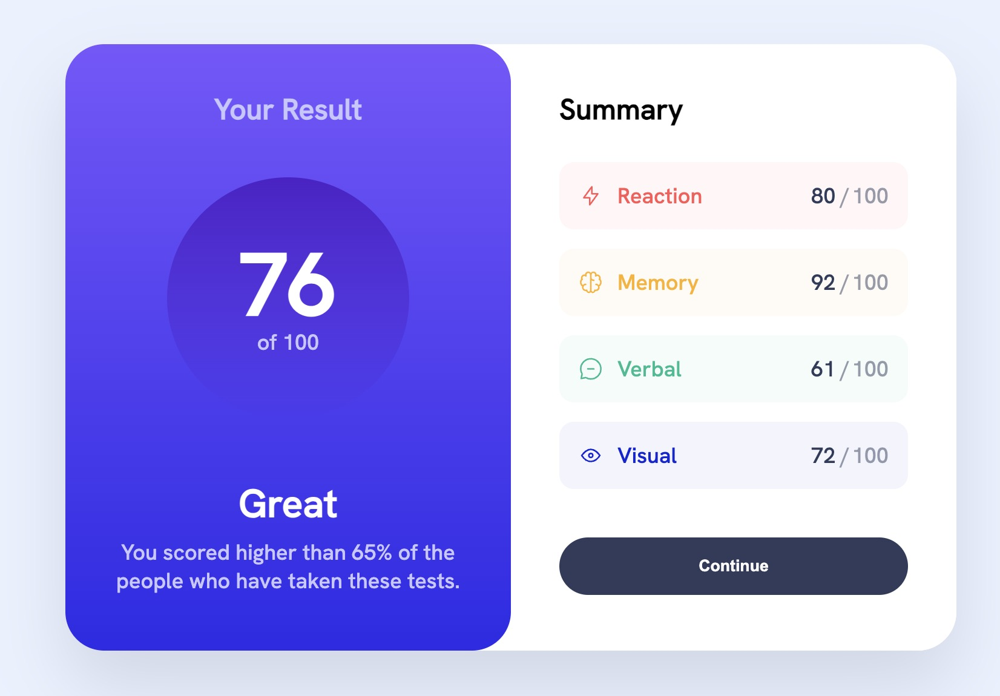

# Frontend Mentor - Results summary component solution

This is a solution to the [Results summary component challenge on Frontend Mentor](https://www.frontendmentor.io/challenges/results-summary-component-CE_K6s0maV). Frontend Mentor challenges help you improve your coding skills by building realistic projects.

## Table of contents

- [Overview](#overview)
  - [The challenge](#the-challenge)
  - [Screenshot](#screenshot)
  - [Links](#links)
- [What I learned](#what-i-learned)
- [Author](#author)

**Note: Delete this note and update the table of contents based on what sections you keep.**

## Overview

### The challenge

Users should be able to:

- View the optimal layout for the interface depending on their device's screen size
- See hover and focus states for all interactive elements on the page
- **Bonus**: Use the local JSON data to dynamically populate the content

### Screenshot



### Links

- Solution URL: [Add solution URL here](https://your-solution-url.com)
- Repository: [Github](https://github.com/Donahuec/frontend-mentor-results-summary-component)
- Live Site URL: [Github Pages](https://donahuec.github.io/frontend-mentor-results-summary-component/)

## What I learned

- Learned about using `aspect-ratio` to create the circle while allowing variable width.

```
.circle {
  aspect-ratio: 1 / 1;
  }
```

- Learned about using property values to allow transitions with gradients

```
/* Allows transition on the gradient values */
@property --gradientStart {
  syntax: "<color>";
  initial-value: white;
  inherits: false;
}

@property --gradientEnd {
  syntax: "<color>";
  initial-value: white;
  inherits: false;
}

button {
  --gradientStart: var(--darkGrayBlue);
  --gradientEnd: var(--darkGrayBlue);
  background: linear-gradient(var(--gradientStart), var(--gradientEnd));
  transition: --gradientStart 250ms ease-in-out, --gradientEnd 250ms ease-in-out;
  &:hover,
  &:focus-visible {
    --gradientStart: var(--lightSlateBlue);
    --gradientEnd: var(--lightRoyalBlue);
  }
  &:active {
    --gradientEnd: var(--lightRoyalBlue);
    --gradientStart: var(--lightRoyalBlue);
  }
}
```

- learned about using html templates

## Author

- Frontend Mentor - [@donahuec](https://www.frontendmentor.io/profile/Donahuec)
